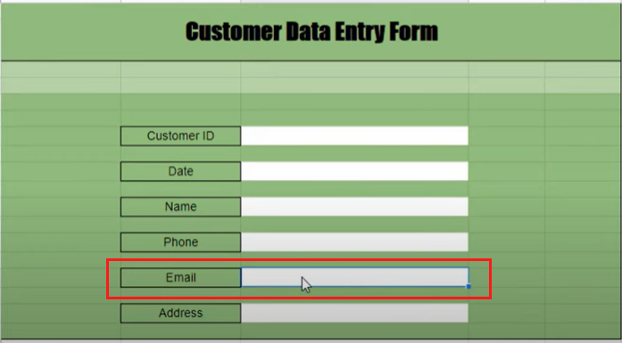

# How to create data entry form in Google Sheets \[Full tutorial]

Reference Tutorial

[https://youtu.be/MJuz8WhFNqU](https://youtu.be/MJuz8WhFNqU)

Example by tutorial

[https://docs.google.com/spreadsheets/d/1w9ws7KkK2Caro-sRjmb6VIP5D9niE0pKIfPqoJ5jDt8/edit?usp=sharing](https://docs.google.com/spreadsheets/d/1w9ws7KkK2Caro-sRjmb6VIP5D9niE0pKIfPqoJ5jDt8/edit?usp=sharing)

Example by me

[https://docs.google.com/spreadsheets/d/1x0iW2-CxKSyZc1lMDSH7CmSzW1PBK-Cu96IqfYaC2JM/edit?usp=sharing](https://docs.google.com/spreadsheets/d/1x0iW2-CxKSyZc1lMDSH7CmSzW1PBK-Cu96IqfYaC2JM/edit?usp=sharing)

<figure><figcaption></figcaption></figure>

<figure><figcaption></figcaption></figure>

<figure><figcaption></figcaption></figure>

<figure><figcaption></figcaption></figure>

<figure><figcaption></figcaption></figure>

<figure><figcaption></figcaption></figure>

<figure><figcaption></figcaption></figure>

<figure><figcaption></figcaption></figure>

<figure><figcaption></figcaption></figure>

<figure><figcaption></figcaption></figure>

<figure><figcaption></figcaption></figure>

<figure><figcaption></figcaption></figure>

<figure><figcaption></figcaption></figure>

<figure><figcaption></figcaption></figure>

<figure><figcaption></figcaption></figure>

<figure><figcaption></figcaption></figure>

<figure><figcaption></figcaption></figure>

<figure><figcaption></figcaption></figure>

<figure><figcaption></figcaption></figure>

<figure><figcaption></figcaption></figure>

<figure><figcaption></figcaption></figure>

<figure><figcaption></figcaption></figure>

<figure><figcaption></figcaption></figure>

<figure><figcaption></figcaption></figure>

<figure><figcaption></figcaption></figure>

 

<figure><figcaption></figcaption></figure>

 

<figure><figcaption></figcaption></figure>

 

<figure><figcaption></figcaption></figure>

